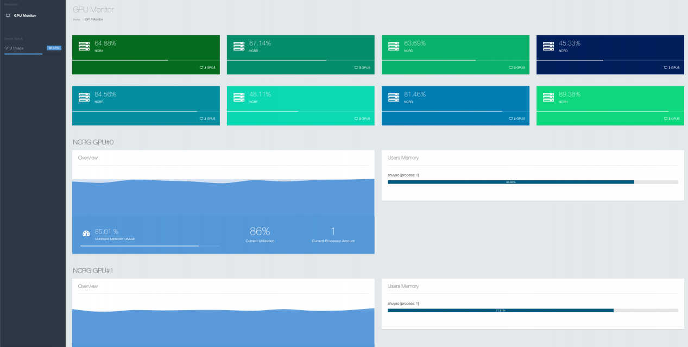

# Preview


# Installation

## Guest machine:

Install required package:
```
sudo apt install python-pip
sudo pip install gpustat
sudo pip install requests
```


Download the script:
```
wget https://github.com/joddiy/Night-Watch/blob/master/py/watch_gpu.py
```


Add the following scheduler to your crontab:
```
* * * * * /usr/bin/python /PATHTO/watch_gpu.py
```
This script will upload its gpu info to the host.

## Host machine:

```
git clone https://github.com/joddiy/Night-Watch.git
```

Please add a ```db.php``` file at ```config``` directory, and its content as following:
```
<?php

return [
    'class' => 'yii\db\Connection',
    'dsn' => 'mysql:host=HOSTNAME;dbname=night_watch',
    'username' => 'USERNAME',
    'password' => 'PASSWORD',
    'charset' => 'utf8',
];
```

(Optinal) Add the following scheduler to your crontab:
```
0 4 1 * * /usr/bin/php5.6 /PATHTO/Night-Watch/yii hello/renew
```
This script will archive old logs and create new tables for new logs.


## For Mysql

You need to create three tables:

### gpu_list

```
create table night_watch.gpu_list
(
  gpu_id    int auto_increment
    primary key,
  cluster   varchar(20)                         not null,
  gpu_order int                                 not null,
  add_time  timestamp default CURRENT_TIMESTAMP not null
);
```
This table records your gpu info. Please be cafeful, your guest machine's host name should be identical with the cluster field here.

### gpu_log
```
create table night_watch.gpu_log
(
  log_id       int auto_increment
    primary key,
  gpu_id       int                                 not null,
  temperature  int                                 not null,
  utilization  int                                 not null,
  power_draw   int                                 not null,
  power_max    int                                 not null,
  memory_used  int                                 not null,
  memory_total int                                 not null,
  add_time     timestamp default CURRENT_TIMESTAMP not null
);

create index gpu_log_add_time_index
  on night_watch.gpu_log (add_time);

create index gpu_log_gpu_id_index
  on night_watch.gpu_log (gpu_id);
```
This table records each gpu's logs.

### gpu_ps
```
create table night_watch.gpu_ps
(
  id               int auto_increment
    primary key,
  log_id           int                                 not null,
  username         varchar(32)                         null,
  command          text                                null,
  cmdline          text                                null,
  gpu_memory_usage int                                 not null,
  pid              int                                 not null,
  add_time         timestamp default CURRENT_TIMESTAMP not null
)
  comment 'gpu process';

create index gpu_ps_add_time_index
  on night_watch.gpu_ps (add_time);

create index gpu_ps_log_id_index
  on night_watch.gpu_ps (log_id);
```
This table records each user's logs.
